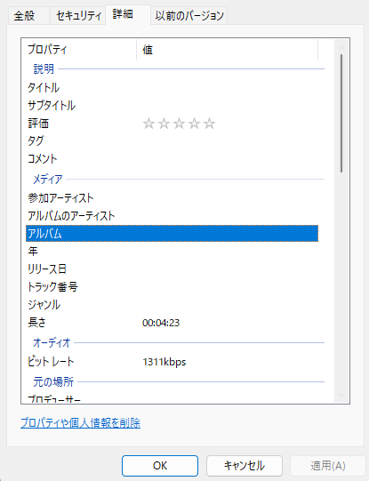

# metaflacで.flacファイルの一括タグ付け

## モチベーション
フリーソフトで複数の.flacファイルに一括でタグ付けする場合、アーティスト名やアルバム名など共通の情報は簡単に一括タグ付けできるがトラック番号や曲名は手作業で個別に編集する必要がある。
そこで、ファイル名(「01. 1曲目.flac」といった様式)からトラック番号と曲名を自動で取得してタグ付けさせる方法を調べた。

## metaflacを使う理由
音楽ファイルのタグを編集するCUIツールをググるとmid3v2やeyeD3といったものがヒットするが、私の環境ではこれらのツールは上手く動作しなかった。
最終的にmetaflacで上手く行っただけである。

## インストール
Arch Linuxではpacmanでflacを入れることでmetaflacが使える。
```bash
sudo pacman -S flac
```

## 基本的な使い方
[公式ドキュメント](https://xiph.org/flac/documentation_tools_metaflac.html)を参照して使う。
公式ドキュメントでは「=」の右側に受け渡す値にはダブルクォーテーションをつけるようにと書いてあるが、ファイル名を指定する場合など、明確に1つの文字列として認識されるような場合は省略しても問題ないようだ。
```bash
 metaflac --set-tag="ARTIST=HOGE" hoge.flac
 metaflac --import-tags-from=fuga.tag hoge.flac
```

## タグ編集手順
### プロパティ名の特定方法
上記の例でも分かるように、metaflacでタグを設定するためには各プロパティ(アルバム名やアーティスト名など)がどのような文字列で定義されているか知っている必要があるが、プロパティ名の一覧は検索しても見つけることができなかった。

代わりに、適当な.flacファイルのタグを手動で編集し、`--export-tags-to=`オプションを使ってタグ一覧を取得する。
Windows11では.flacファイルのプロパティの「詳細」タブからタグを編集することができるため、ここで編集したい項目を一通り編集してからコマンドでファイルに出力する。



```bash
metaflac --export-tags-to=hoge.tag hoge.flac
```

上述のWindowsの「プロパティ」の「詳細」欄で編集し保存できた項目は以下のように出力ファイルのhoge.tagに含まれているはずである。
```
ALBUM=Piyo
TRACKNUMBER=1
ARTIST=Fuga
GENRE=Wood
COMPOSER=foo
ORGANIZATION=bar
YEAR=2023
TITLE=hoge
```
ここで分かったプロパティ名をmetaflacの--set-tagオプションで用いれば各タグ項目を編集することができる。

### タグ付けファイルの作成
今回は複数ファイルのタグを一括編集することが目的であるため、ファイル名からトラック番号とタイトルを取得して自動でタグを編集するスクリプトを作成することが当初の目的だった。おそらくシェルスクリプトでもできることだが、私はbashの文法に疎いため、一旦Pythonで各.flacファイルに対応したタグ付けファイルを生成したあとmetaflacの--import-tags-fromでタグ付けする2段階の手順で進める。

タグ付け用のファイルは以下のスクリプトで作成する。
```python3
import glob
files = glob.glob("./*.flac")  # .flacファイルのリストを取得

# 共通タグを定義
COMPOSER = "foo"
ORGANIZATION = "bar"
ALBUM = "Piyo"
YEAR = 2023
ARTIST = "Fuga"
GENRE = "Wood"

for flac in files:
    tracknum = int(flac[2:4])  # ファイル名の先頭から2文字のトラック番号を取得
    title = flac[5:flac.rfind(".")]  # ファイル名の4文字目から拡張子のすぐ前までの範囲でタイトル取得
    with open(f"{flac}.tag", "w") as ftag:  # <.flacファイル名>.tagの名前でタグ付けファイルを生成
        ftag.write(f"COMPOSER={COMPOSER}\n")
        ftag.write(f"ORGANIZATION={ORGANIZATION}\n")
        ftag.write(f"TRACKNUMBER={tracknum}\n")
        ftag.write(f"ALBUM={ALBUM}\n")
        ftag.write(f"YEAR={YEAR}\n")
        ftag.write(f"TITLE={title}\n")
        ftag.write(f"ARTIST={ARTIST}\n")
        ftag.write(f"GENRE={GENRE}")

```
使い捨てのスクリプトであるためトラック番号やタイトルは余り汎用性を考えず決め打ちで取得している。

### 生成したファイルから一括タグ付け
.flacファイルと、<.flacファイルのファイル名>.tagの名前のタグ付け用ファイルがあるディレクトリで以下を実行する。

```bash
ls *.flac | xargs -I{} metaflac --import-tags-from='{}.tag' {}
```
タグ付け用ファイルの名前を<.flacファイルのファイル名>.tagで生成したのはここでファイル名の操作を極力しないためである。実行が終わったらファイルのプロパティからタグ付けができているか確認する。

### ジャケット画像設定
タグファイルでジャケットの画像は指定していなかったので、以下のコマンドで設定する。
```
ls *.flac | xargs -I{} metaflac --import-picture-from='./jacket.png' {}

```

## 終わりに
音源ファイルタグ付け関連記事でプロパティ名の一覧が記載されているものがあまりなくて苦労したが、この方法ならWindowsで設定できるタグは全て特定できるため検索の手間が少し減る。
